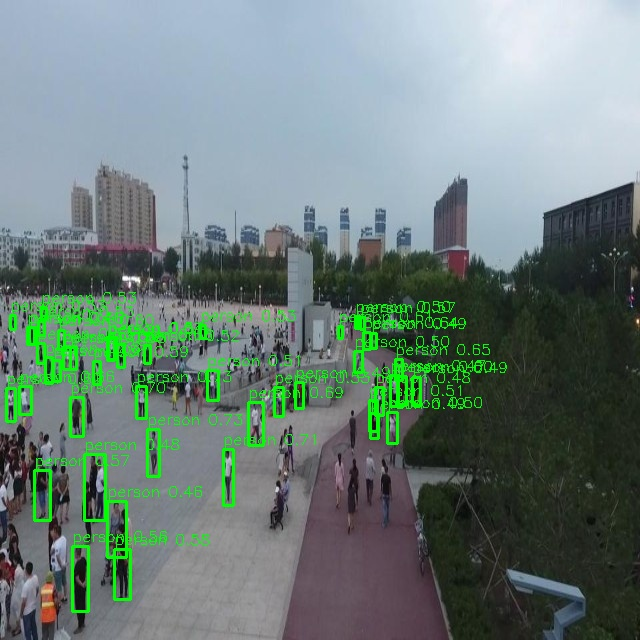

# Human-Detection-for-Search-and-Rescue-Onboard-vs-Edge-vs-Cloud-Inference
This project focuses on human detection for Search and Rescue (SAR) operations using drones and the YOLOv8n deep learning model. The model was trained on the VisDrone dataset and deployed across three different inference architectures: onboard inference using a Raspberry Pi 3 Model B+ instead of drone,and in edge inference using and cloud inference we use client as raspberry pi and server as laptop. A total of 300 test images were used for evaluation, and five experimental runs were conducted for each deployment scenario to ensure consistent results. The system was evaluated based on inference latency and power consumption, while the output consisted of human detections with bounding boxes drawn around detected individuals in aerial images. The comparative analysis helps identify the most efficient architecture for real-time SAR drone applications.

# what we are comparing:
we are comparing latency(preprocess+transmission+infernece) in three different scenarios

- Onboard Scenario- rasp pi 3 as client snd server
- Edge Scenario- rasp pi 3 as client and laptop as server
- Cloud Scenario- rasp pi 3 as client and gpu laptop as server
- dataset: Visdrone
  

# Software Used

- **Python** – Used to develop the entire project and integrate all components of the human detection system.

- **YOLOv8 (Ultralytics)** – Used for real-time human detection in aerial images captured during search and rescue operations.

- **PyTorch** – Used as the deep learning framework to run and support the YOLOv8 model for inference.

- **OpenCV** – Used for image processing, video/frame handling, and drawing bounding boxes around detected humans.

- **NumPy** – Used for efficient numerical computations and handling image data as arrays.

- **PyYAML** – Used for reading and managing configuration files for model and system settings.

- **Requests** – Used for communication between client (Raspberry Pi) and server (edge/cloud) using HTTP requests.

- **TQDM** – Used to display progress bars during dataset processing and evaluation runs.

- **PSUtil** – Used to monitor system performance such as CPU usage, memory usage, and resource consumption during experiments.
  
- **Matplotlib** – Used for generating graphs and analyzing results such as latency comparison and performance visualization.

- **TCP Protocol** – Used for communication between client (Raspberry Pi) and server for transmitting images and receiving inference results.

- **YOLOv8n Pretrained Model** – A pretrained object detection model was used and fine-tuned and trained only for detecting humans in aerial images.

# Hardware Used

- Raspberry Pi 3 Model B+ (Client / Onboard processing unit)  
- Laptop (Edge server)  
- GPU-enabled Laptop (Cloud server for accelerated inference)  
- usbpowermeter - for calculating power

## Observations
- Onboard inference has minimal communication delay but limited computational power.
- Cloud inference has high computational capability but suffers from network latency.
- Edge inference achieves the best trade-off between computation and communication, resulting in the most efficient performance in this study.

- Edge inference achieves the best latency performance compared to both onboard and cloud scenarios in this comparison.
  

## Inference Output

## Latency Comparison

## Average Latency Breakdown

## System Architecture

